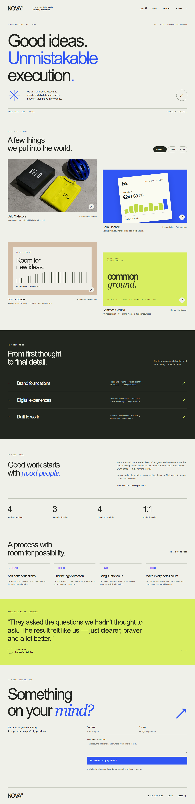
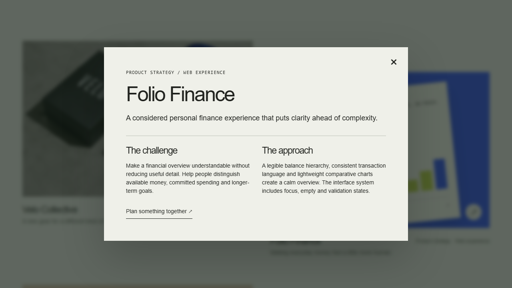
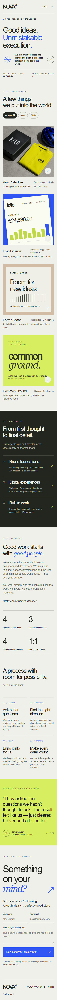

# NOVA Studio

A fictional independent design-studio website built as an editorial frontend exercise in vanilla JavaScript.



The site presents four project case studies, studio services and process, collaborator quotes and a small project-brief builder. It is intentionally a visual portfolio experience rather than a client-management application or production contact service.

## Selected work

The work section can be filtered between brand and digital projects without navigating away from the page. Filter state is visible in the controls and the resulting project count is announced for assistive technology.

Each project opens into a native dialog with additional case-study material. Dialogs support keyboard dismissal and restore focus to the originating project when closed.



The featured identities and outcomes are fictional work created for this repository; they are not presented as commercial client engagements.

## Interaction

NOVA uses a deliberately small frontend stack: semantic HTML, CSS and vanilla JavaScript.

`src/main.js` coordinates the responsive navigation, project filtering, case-study dialogs, section reveals, counters, collaborator quote selection and project brief. The implementation keeps those interactions in the browser without introducing a framework or application state library.

The visual direction is editorial rather than application-like: oversized typography, asymmetric project presentation, ruled sections and restrained motion. Decorative movement is disabled when reduced motion is requested.

## Project brief

The contact section is a local brief builder rather than a submission form. It validates the required fields and exports the entered brief for the visitor to keep.

No personal information is transmitted to a server because the project has no backend, email service or analytics integration. The brief exists only in the browser until the visitor downloads it or leaves the page.

## Accessibility

Interactive elements use semantic controls and visible keyboard focus. Case studies use native dialogs, filters expose their selected state, collaborator quotes are keyboard selectable, and the mobile navigation remains operable without pointer input.

The browser suite also checks representative pages with axe. Automated checks are regression coverage, not a claim of complete accessibility certification.

## Development

Requires Node.js 24 and npm.

```bash
npm ci
npm run dev
```

Quality/build commands:

```bash
npm run lint
npm run build
npx playwright install chromium
npm test
```

Tests cover project filtering and announced counts, dialog opening/Escape/focus restoration, whitespace-aware brief validation and download, keyboard quote selection, mobile navigation, local links/images, console errors and automated accessibility checks.

Vite supports a configurable `BASE_PATH`; the included GitHub Actions workflow validates and publishes the static build to GitHub Pages.

## Structure

```text
src/
  main.js             Page interactions
  style.css           Layout, typography and responsive states
public/
  media/              Project-specific visual asset
  icons/              Local interface assets
tests/                Browser interaction coverage
docs/screenshots/     Captures of the running site
.github/workflows/    Validation and Pages publishing
```



## Assets

The site uses system fonts and local interface assets. `public/media/velo.webp` is an original project-specific image created for the fictional VELO case study; the remaining work visuals are HTML/CSS compositions rather than downloaded client material.

No third-party stock photography or external font service is required at runtime.

## Scope

NOVA Studio is deliberately lightweight. It does not include a CMS, backend, persistent form submissions, authentication, analytics or external client data. Those omissions match the purpose of the project: demonstrating editorial frontend composition and interaction rather than simulating infrastructure that is not needed.

## License

This repository is source-available for portfolio review and evaluation only. The original code, designs, media, and other original materials are **not open source** and may not be reused, redistributed, incorporated into other projects, or commercially exploited without prior written permission. See the [Portfolio Source License](LICENSE) for the complete terms. Third-party dependencies retain their upstream licenses.
